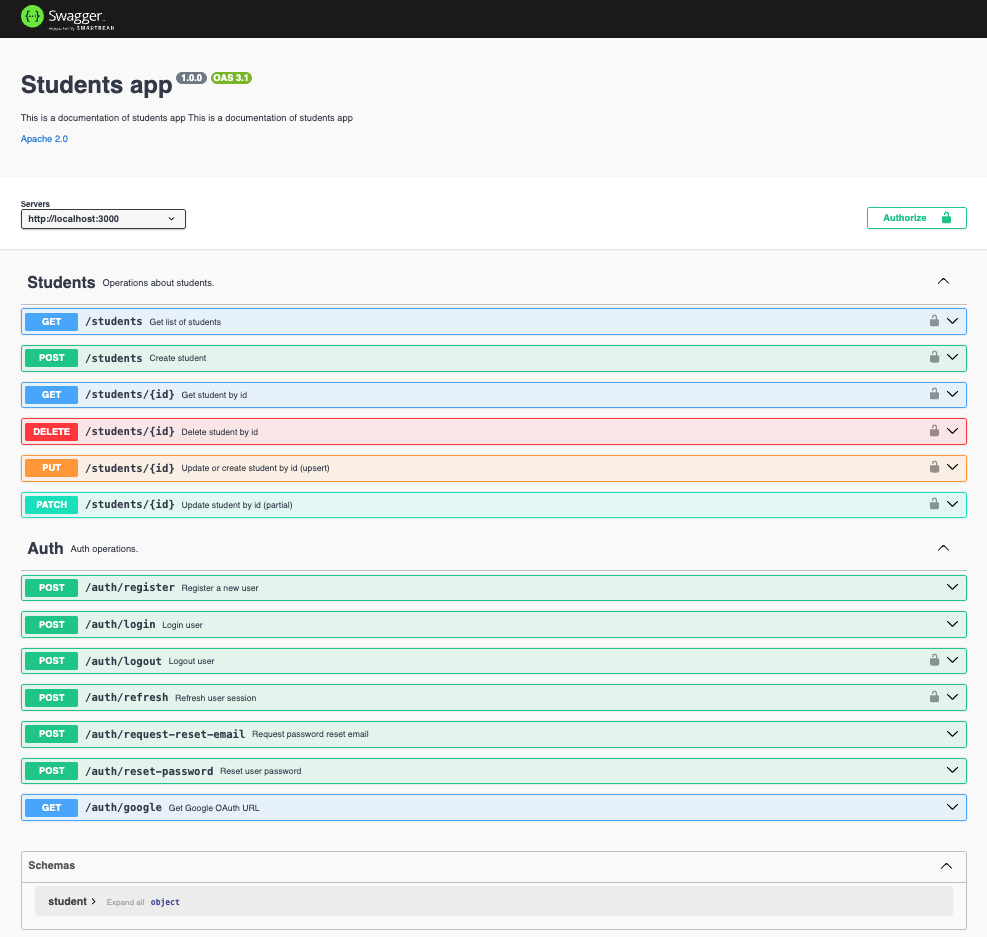

# Node.js Backend

## Students API



An overview of the Node.js backend project showcasing its modular architecture and scalability.

A scalable, well-structured Node.js backend project following industry best practices. This project emphasizes clear documentation, modular architecture, and developer experience.

## Table of Contents

- [Node.js Backend](#nodejs-backend)
  - [Students API](#students-api)
  - [Table of Contents](#table-of-contents)
  - [Features](#features)
  - [Tech Stack](#tech-stack)
  - [Folder Structure](#folder-structure)
  - [Getting Started](#getting-started)
  - [Environment Variables](#environment-variables)
  - [Scripts](#scripts)
  - [API Documentation](#api-documentation)
  - [Code Quality](#code-quality)
  - [Testing](#testing)
  - [Contributing](#contributing)
  - [License](#license)

## Features

- RESTful API architecture
- Modular and scalable folder structure
- Environment-based configuration
- Centralized error handling and logging
- Automated testing setup
- Linting and formatting for code quality
- Comprehensive documentation

## Tech Stack

- **Node.js** – JavaScript runtime
- **Express.js** – Web framework
- **MongoDB** (with Mongoose) – Database and ODM
- **dotenv** – Environment variable management
- **Jest** or **Mocha/Chai** – Testing framework
- **ESLint** & **Prettier** – Code linting and formatting
- **Swagger** or **OpenAPI** – API documentation (recommended)
- **Winston** or **Morgan** – Logging

> _Note: Please update this section to reflect the actual technologies used in your project._

## Folder Structure

```
/nodejs-backend
├── src/
│   ├── controllers/
│   ├── routes/
│   ├── models/
│   ├── middlewares/
│   ├── utils/
│   └── app.js
├── tests/
├── docs/                # API documentation (e.g., Swagger)
├── .env.example
├── package.json
└── README.md
```

## Getting Started

1. **Clone the repository:**

   ```bash
   git clone https://github.com/yourusername/nodejs-backend.git
   cd nodejs-backend
   ```

2. **Install dependencies:**

   ```bash
   npm install
   ```

3. **Configure environment variables:**

   - Copy `.env.example` to `.env` and fill in the required values.

4. **Run the application:**
   - Development:
     ```bash
     npm run dev
     ```
   - Production:
     ```bash
     npm start
     ```

## Environment Variables

Create a `.env` file in the root directory. Example:

```
PORT=3000
DB_URI=mongodb://localhost:27017/dbname
JWT_SECRET=your_jwt_secret
# Add other variables as needed
```

## Scripts

| Command        | Description               |
| -------------- | ------------------------- |
| `npm run dev`  | Start in development mode |
| `npm start`    | Start in production mode  |
| `npm test`     | Run tests                 |
| `npm run lint` | Run linter                |

## API Documentation

- API endpoints and schemas are documented using **Swagger** (OpenAPI).
- To view the documentation, start the server and visit:
  `http://localhost:3000/api-docs`
- Documentation files are located in the `docs/` directory.

> _Well-documented APIs improve maintainability and developer onboarding._

## Code Quality

- **ESLint** and **Prettier** are used to enforce code style and quality.
- Follow [Conventional Commits](https://www.conventionalcommits.org/) for commit messages.

## Testing

- Tests are located in the `tests/` directory.
- Run all tests:
  ```bash
  npm test
  ```

## Contributing

Contributions are welcome! Please open an issue or submit a pull request.
See [CONTRIBUTING.md](CONTRIBUTING.md) for guidelines.

## License

This project is licensed under the [MIT](LICENSE) License.

---

> For questions or support, please open an [issue](https://github.com/yourusername/nodejs-backend/issues).
